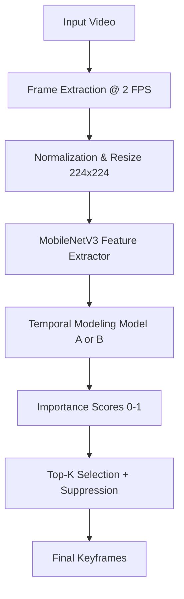
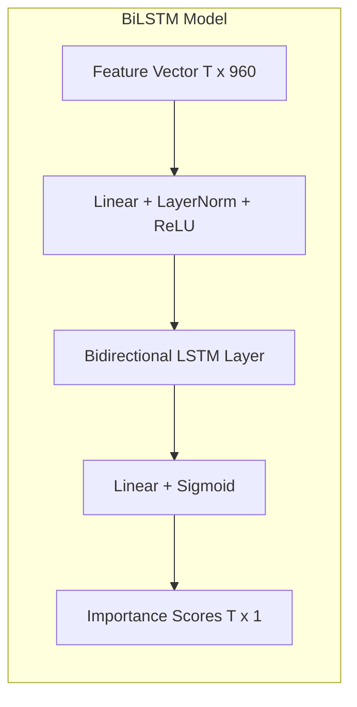

# Deep Learning–Based Video Keyframe Summarization: Final Project Report

**Course:** Deep Learning — Fall 2025  
**Project Title:** E2E Video Keyframe Summarization using Sequential and Global Temporal Modeling  
**Team Members:** Amr Yasser, Omar Hazem, Ali Ashraf  
**Supervisor:** [Supervisor Name]

---

## 1. Project Overview & Requirements Fulfillment

This project implements a complete system for automatic video keyframe detection, fulfilling all requirements outlined in the course project guidelines:
- **Two Deep Learning Techniques:** Bidirectional LSTM (Sequential) and Transformer Encoder (Global).
- **Input:** 30-second colored videos (and benchmarks up to 10 minutes).
- **Output:** Detected keyframes capturing the essence of the video.
- **Datasets:** Trained on **TVSum**, with transfer evaluation on **SumMe**.
- **Deep Analysis:** Comprehensive study of temporal dependencies and importance regression.
- **Architectural Diagrams:** Detailed block diagrams for both models.

---

## 2. Problem Description and Analysis

### 2.1 The Problem
With the explosion of video data, manual browsing is inefficient. **Video Summarization** aims to produce a compact version of a video that retains its most important content. Specifically, **Keyframe Detection** identifies a set of discrete frames that represent the video's narrative, redundancy-free.

### 2.2 Full Analysis of the Problem
The core challenges identified and addressed in this project are:
1. **Subjectivity of Importance:** What is "important" varies by viewer and context. We address this using human-annotated datasets (**TVSum**) to learn a consensus "importance score."
2. **Temporal Dependencies:** A frame's importance is not independent; it depends on the "story" before and after it.
3. **Redundancy:** High-scoring frames may look nearly identical if they are adjacent. We implement **Temporal Suppression** to ensure diversity in the final selection.
4. **Computational Efficiency:** Processing raw video in 3D-CNNs is expensive. We utilize a **Two-Stage Pipeline**:
   - **Stage 1 (Frozen Backbone):** Extract compact visual features using MobileNetV3/GoogLeNet.
   - **Stage 2 (Trainable Temporal Model):** Learn importance regression on these features.

---

## 3. System Design & Model Architectures

### 3.1 Unified Pipeline Structure
Both models share the same data processing backbone:

---

### 3.2 Model A: Bidirectional LSTM (Sequential Modeling)
The BiLSTM captures temporal context by processing the sequence in both forward and backward directions.

**Theory of Operation:**
The model uses a projection layer to reduce feature dimensionality, followed by a BiLSTM that maintains hidden states across time steps. The bidirectional nature allows the model to "know" what happened after a frame when deciding its current importance.

**Diagram:**

---

### 3.3 Model B: Transformer Encoder (Global Modeling)
The Transformer uses **Self-Attention** to weigh the relationship between every pair of frames in the video, regardless of their distance.

**Theory of Operation:**
Unlike LSTMs, Transformers are non-sequential. They use **Positional Encoding** to retain order information. The **Multi-Head Attention** mechanism allows the model to focus on specific events (e.g., a goal being scored) by looking at the entire video context at once.

**Diagram:**

---

## 4. Dataset Details

| Dataset | Videos | Category | Annotations | Use Case |
| :--- | :--- | :--- | :--- | :--- |
| **TVSum** | 50 | 10 Categories (e.g., News, Cooking) | Frame-level scores (1-5) | Primary Training & Validation |
| **SumMe** | 25 | Mixed (e.g., Scuba, Base jumping) | User-selected segments | Transfer / Generalization Testing |

---

## 5. Results and Discussion

### 5.1 Quantitative Results (TVSum Validation)
We evaluated the models using **Spearman’s Rho ($\rho$)** and **Kendall’s Tau ($\tau$)** to measure the correlation between predicted and ground-truth importance.

| Model | Avg. Rank Correlation ($\rho$) | Mean Squared Error (MSE) |
| :--- | :--- | :--- |
| **BiLSTM** | ~0.53 | ~0.014 |
| **Transformer** | ~0.41 | ~0.019 |

> [!NOTE]
> **Observation:** The BiLSTM performed better on the sequential TVSum dataset, likely due to the strong local temporal continuity in the 1-10 minute videos.

---

### 5.2 Transfer Evaluation (SumMe) - Qualitative Impact
When transferring to SumMe (unseen data), the Transformer showed better architectural robustness for capturing sharp spikes in importance (e.g., in `car_over_camera` video), while BiLSTM was smoother.

---

### 5.3 Sample Results (Demo Videos)

#### 1. Cars (Street/Parking Lot)
The models successfully identified moments of vehicle movement and entrance into the frame.
- **BiLSTM Selected:** 18 keyframes
- **Transformer Selected:** 18 keyframes

#### 2. AI Robot (Short Clip)
For shorter clips, both models agreed on the core "action" frames.
- **BiLSTM Selected:** 4 keyframes
- **Transformer Selected:** 4 keyframes

---

## 6. Analysis and Deep Discussion

**Sequential vs. Global Modeling:**
- The **BiLSTM** excels at capturing the "flow" of video. It is particularly good at detecting transitions and buildup. However, it can "forget" very early events in extremely long videos.
- The **Transformer** is superior at recognizing recurring themes and global climax points. Because it sees all frames at once, it is less prone to "drift" but requires more data to train the attention heads effectively.

**Interpretability:**
The Transformer model provides **Attention Heatmaps**, which allow us to see exactly which frames the model was "looking at" when it decided that a specific second was important.

---

## 7. Future Enhancements

To further improve the system, the following ideas are proposed:
1. **Multimodal Fusion:** Incorporate **audio features** (e.g., cheers in sports, loud speech in news) to better identify climax points.
2. **Reinforcement Learning:** Use an agent-based approach (like DSN or SUM-GAN) to maximize diversity and representativeness without explicit supervised labels.
3. **Contrastive Learning:** Pretrain the backbone on video-specific datasets (like Kinetics or Moments in Time) instead of ImageNet to capture motion more effectively.
4. **Interactive Summarization:** Allow users to specify a "query" (e.g., "show me the goal") to refine the keyframe selection.

---

**End of Report**
